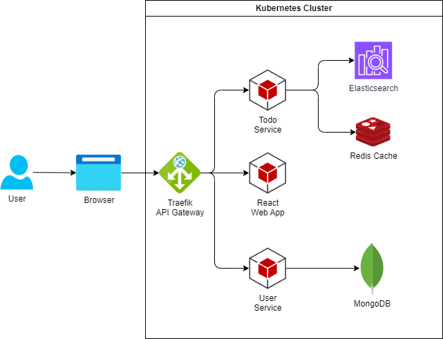

# 02 - Kubernetes, Helm

## Cél

A labor célja:

- megismerni a Kubernetes használatának alapjait
    - a _podok_, _Deployment-ek_ és _ReplicaSet-ek_ létrehozását és kezelését,
    - a leggyakrabban használt `kubectl` parancsokat.
- egy alkalmazás telepítése Kubernetes klaszterbe és a frissítés módjának megismerése.
    - A telepítéshez és frissítéshez részben Helm chartot, részben magunk által elkészített YAML erőforrás leírókat használunk.

## Előkövetelmények

A labor Windows platformon lett kidolgozva, de Linuxon is hasonlóan működik.

- Kubernetes
    - Bármely felhő platform által biztosított klaszter
    - Linux platformon: [minikube](https://kubernetes.io/docs/start)
    - Windows platformon: Docker Desktop
- [kubectl](https://kubernetes.io/docs/tasks/tools/)
    - A binárisa legyen elérhető PATH-on.
- Egy kubernetes-t menedzselni képes GUI, például:
    - [VS Code Kubernetes extension](https://marketplace.visualstudio.com/items?itemName=ms-kubernetes-tools.vscode-kubernetes-tools)
    - [Lens](https://k8slens.dev/)
    - [Kubernetes Dashboard](https://kubernetes.io/docs/tasks/access-application-cluster/web-ui-dashboard/)
    - [Rider](https://www.jetbrains.com/help/rider/Kubernetes.html) - hallgatói fiókkal ingyenes
    - [k9s](https://k9scli.io/)
- Helm CLI
    - [Helm](https://helm.sh/docs/intro/install/)
    - A Helm CLI legyen elérhető PATH-on.

## Előkészület

A feladatok megoldása során ne felejtsd el követni a feladat beadás folyamatát [GitHub](../../information/GitHub.md).

### Git repository létrehozása és letöltése

1. Moodle-ben keresd meg a laborhoz tartozó meghívó URL-jét és annak segítségével hozd létre a saját repository-dat.
2. Várd meg, míg elkészül a repository, majd checkout-old ki.
3. Hozz létre egy új ágat `megoldas` néven, és ezen az ágon dolgozz.
4. A `neptun.txt` fájlba írd bele a Neptun kódodat. A fájlban semmi más ne szerepeljen, csak egyetlen sorban a Neptun kód 6 karaktere.

!!! danger "NEPTUN"
    :exclamation: A feladatokban a `neptun` kifejezés helyett a saját neptunkódunkat helyettesítsük be minden esetben :exclamation:

## 0. Feladat

### Előkészület Docker Desktop-on

1. Praktikus, ha leállítunk minden futó konténert, amire nincs szükségünk. Használhatjuk a következő parancsot PowerShell-ben:

    ```powershell
    docker rm -f $(docker ps -aq)
    ```

2. Nyissuk meg a Docker Desktop beállításait.

3. A _Kubernetes_ fülön pipáljuk be az _Enable Kubernetes_ opciót, és kattintsunk az _Apply_-ra.

4. Várjuk meg, amíg befejeződik a művelet. A kubernetes alrendszer elindulása néhány percet is igénybe vehet.

    

### Kubectl csatlakozás a klaszterhez

- Ellenőrizzük, hogy a `kubectl` bináris elérhető-e, és tud-e csatlakozni a klaszterhez:

    ```cmd
    kubectl version
    ```

    A `kubectl` a CLI kliens a klaszter kezeléséhez (ejtsd: cube control).
    A Kubernetes API szerveréhez csatlakozik, annak REST API-ján keresztül végzi a műveleteket.
    Láthatjuk mind a kliens, mind a klaszter verzió információit.

- A `kubectl` egy konkrét klaszterhez csatlakozik. Nézzük meg, milyen klasztereket ismer:

    ```cmd
    kubectl config get-contexts
    ```

    - Ha több klaszterrel dolgoznánk, itt láthatnánk őket.
    - Ezek valójában egy konfigurációs fájlban vannak: `%userprofile%/.kube/config`
    - Váltani a `kubectl config use-context <név>` parancssal lehet.
    - Minden parancsnál külön megadhatjuk a kontextust a `--context` kapcsolóval, de inkább az implicit contextust szoktuk használni.
    - Kontextus beállításról részletesebben [itt](https://kubernetes.io/docs/reference/kubectl/cheatsheet/#kubectl-context-and-configuration).

!!! tip "Kubernetes GUI"
    A feladatokban lévő műveletek szinte mindegyike elvégezhető a GUI (pl.: VS Code kubernetes kiegészítő) segítségével is. A labor leírásaiban a `kubectl` parancsokat fogjuk használni, de a GUI is használható. 

## 1. Feladat

### Podok és névterek listázása

- Listázzuk ki a futó podokat:

    ```cmd
    kubectl get pod -A
    ```

    A `-A` vagy `--all-namespaces` kapcsoló az összes névtérben levő podot listázza.

- Ismételjük meg a `-A` kapcsoló nélkül:

    ```cmd
    kubectl get pod
    ```

    Ez az alapértelmezett _default_ névtér podjait listázza. (Az alapértelmezett névtér is a kontextus beállítása.)

- Nézzük meg, milyen névterek vannak: `kubectl get namespace`

- Listázzuk a podokat egy konkrét névtérben: `kubectl get pod -n kube-system`

### Pod létrehozása YAML leíróval

Kubernetes erőforrásokat tipikusan YAML leírókban definiálunk. A futtatás elemi egysége a pod, így készítsünk egy YAML fájlt a podunkhoz és indítsuk el azt.

!!! tip ""
    A leíró szerkesztéséhez használhatjuk például Visual Studio Code-ot. Érdemes olyan szövegszerkesztővel dolgozni, amely ismeri a YAML szintaktikát. A parancsok futtatásához használhatjuk például [Visual Studio Code beépített terminálját](https://code.visualstudio.com/docs/terminal/basics).

1. Hozzunk létre egy új YAML fájt a repositorynk gyökerébe `createpod.yml` néven, az alábbi követelmények mentén

   - a kubernetes leíró Pod-ot definiál
   - a pod neve legyen `counter-neptun` a **saját neptunkóddal** kiegészítve
   - a pod egy konténert tartalmazzon, amely az `ubuntu` képből indul
   - a konténer egy bash parancsot futtasson, ami kiírja a _NEPTUN_ kódodat és 5 másodpercenként kiírja az aktuális időt.

1. A konzolunkban navigáljunk el abba a könyvtárba, ahol a YAML fájl van, majd hozzuk létre a podot:

    ```cmd
    kubectl apply -f createpod.yml
    ```

    !!! warning "apply vs create"
        A `create` helyett `apply` parancsot használjuk. Az apply létrehozza, ha nem létezik, és módosítja az erőforrást, ha már létezik.

1. A pod létrejött. Ellenőrizzük:

    ```cmd
    kubectl get pod
    ```

1. Nézzük meg a pod logjait:

    ```cmd
    kubectl logs counter-neptun
    ```

    !!! tip ""
        Ha gondoljuk, tegyük hozzá a `-f` kapcsolót is (`kubectl logs -f counter`) a log követéséhez. ++ctrl+c++-vel léphetünk ki a log folyamatos követéséből. Ne feledjük, hogy ez nem a pod terminálja, hanem a logjainak figyelését.

!!! example "BEADANDÓ"
    A feladathoz tartozó forráskódot commitold be és készíts egy képernyőképet (`f1.1.png`), majd commitold azt be a házi feladat repó gyökerébe, amin a futó pod logjai látszanak.

1. Töröljük a podot:

    ```cmd
    kubectl delete pod counter-neptun
    ```

1. Ellenőrizzük, hogy a pod tényleg eltűnik egy kis idő múlva:

    ```cmd
    kubectl get pod
    ```

    !!! note ""
        A pod törlése nem azonnali. A benne futó konténerek leállás jelzést kapnak, és ők maguk terminálhatnak. Ha ez nem történik, meg, akkor kis idő múlva megszünteti őket a rendszer.

??? tip "Interaktív shell"
    Ha szeretnénk egy podban belépni, és ott dolgozni, akkor ezt a `kubectl exec` paranccsal tehetjük meg. Például:

    ```cmd
    kubectl exec -it <podnév> /bin/bash
    ```

    A `-it` kapcsolók interaktív módot és terminált biztosítanak. A `/bin/bash` a shell, amit futtatni szeretnénk.

    Ahogy a docker-nél már láthattuk, egy új shell indul a pod konténerében, és ehhez csatlakozunk.
    Ebben a shellben, ahogy natív docker esetében is, bármit megtehetünk.

## 2 Feladat

### 2.1 Deployment létrehozása

A podokat nem szoktuk közvetlenül létrehozni, hanem _Deployment_-re és _ReplicaSet_-re szoktunk bízni a kezelésüket és létrehozásukat.

1. Hozzunk létre egy új YAML fájlt `createdeployment.yml` néven az alábbi követelményeknek megfelelően:

    - a kubernetes leíró Deployment-et definiál
    - a deployment neve legyen `counter-neptun` a **saját neptunkóddal** kiegészítve
    - a deployment egy olyan konténert definiáljon, mint az 1. feladatban
    - 1 replika legyen az elvárt állapot
    - a selectorok használata során `counter-app-neptun` címkét használjuk a **saját neptunkóddal** kiegészítve

2. Hozzuk létre a Deployment-et:

    ```cmd
    kubectl apply -f createdeployment.yml
    ```

3. Listázzuk a Deployment-eket, ReplicaSet-eket és a podokat:

    ```cmd
    kubectl get deployment
    kubectl get replicaset
    kubectl get pod
    ```

    Vegyük észre, hogy a pod neve generált, a _Deployment_ és a _ReplicaSet_ alapján kap automatikusan egyet.

!!! example "BEADANDÓ"
    Készíts egy képernyőképet (`f2.1.png`) és commitold azt be a házi feladat repó gyökerébe, amin a futó deployment, replicaset és pod neve látszik.
    Commitold be a forráskódot is.

### 2.2 Deployment frissítése

A _Deployment_ szolgál az alkalmazás verziónak frissítésére, kiadására.

Változtassuk meg a program futását a deployment leíróján keresztül: ne 5, hanem 10 másodpercenként írjuk ki az időt.
Ezt a _Deployment_ módosításával érhetjük el, mivel podot nem tudunk szerkeszteni hatékonyan, egy futó pod nem cserélhető le.
Ehelyett valójában egy új podot kell létrehozni indirekt módon a deployment frissítésével.

Érvényesítsd a módosítást a deployment leíróban, majd alkalmazd a változást:

```cmd
kubectl apply -f createdeployment.yml
```

Kérjük le a logokat a deployment podjából:

```cmd
kubectl logs -f <podnév>
```

!!! example "BEADANDÓ"
    Készíts egy képernyőképet (`f2.2.png`) és commitold azt be a házi feladat repó gyökerébe, ahol a logokban már 10 másodpercenként történik a kiíratás.

??? tip "Kubectl parancsok"

    A `kubectl` leggyakrabban használt parancsainak szerkezete: `kubectl <ige> <erőforrás> <attribútumok>`.

    Az ige például:

    - `get`: listázza az erőforrásokat
    - `create`: létrehoz egy erőforrást
    - `delete`: töröl egy erőforrást
    - `describe`: lekérdezi az erőforrás részletes állapotát
    - `edit`: letölti az erőforrás leíróját, és megnyitja szövegszerkesztőben; mentés és bezárás után frissíti a klaszterben az erőforrást a módosítások alapján

    Az erőforrások a `pod`, `replicaset` vagy röviden `rs`, a `deployment`, stb.

    A parancsokról `-h` kapcsolóval kaphatunk segítséget, pl. `kubectl describe -h`

## 3. Feladat

### Célok

A célunk a kiinduló repóban lévő, todo-kat kezelő konténeralapú, külön álló (mikro)szolgáltatásokra épülő webalkalmazás telepítése Kubernetes-be.
A rendszerünk alapvetően három fajta komponensből épül fel:

- az általunk megvalósított mikroszolgáltatások (backendek és frontend),
- az adatbázis rendszerek (MongoDB, Elasticsearch és Redis),
- valamint az api gateway.



Célunk nem csak az egyszeri telepítés, hanem az alkalmazás naprakészen tartásához a folyamatos frissítés lehetőségének megteremtése.
A fenti komponensek azonban nem ugyanolyan frissítési ciklussal rendelkeznek: a saját komponenseink gyakran fognak változni, míg az adatbázisok és az api gateway ritkán frissül.
A telepítést ennek megfelelően most ketté vágjuk:

1. Az api gateway-t és az adatbázisokat egyszer telepítjük manuálisan.
2. Az alkalmazásunk saját komponenseihez YAML alapú leírókat készítünk, amit `kubectl apply` segítségével fogunk telepíteni, illetve ezeket a leírókat Helm-mel fogjuk kezelni.

### 3.0 Helm

Ellenőrizzük, hogy a `helm` CLI elérhető-e:

```cmd
helm version
```

!!! warning "Helm 3"
    A feladat során a Helm 3-as verzióját fogjuk használni. A korábbi verziója koncepcióban azonos, de működésében eltérő.

### 3.1 Ingress Controller (api gateway) telepítése Helm charttal

A Traefik-et [Helm charttal](https://github.com/traefik/traefik-helm-chart) fogjuk telepíteni, mert a Traefik helyes működéséhez a Traefik konténer (Deployment) mellett egyéb elemekre is szükség lesz (klaszteren belüli hozzáférés szabályzás miatt).

!!! warning "Chart-ok ellenőrzése"
    A Helm chartok nagy része harmadik féltől származik, így a klaszterünbe való telepítés előtt a tartalmukat érdemes alaposan megnézni.

1. A Helm is repository-kkal dolgozik, ahonnan a chart-okat letölti. Ezeket regisztrálni kell. Regisztráljuk a Traefik hivatalos chart-ját tartalmazó repository-t, majd frissítsük az elérhető char-okat:

    ```cmd
    helm repo add traefik https://traefik.github.io/charts
    helm repo update
    ```

1. Telepítsük:

    ```cmd
    helm install traefik traefik/traefik --set ports.web.nodePort=32080 --set service.type=NodePort --set "additionalArguments={--api.insecure=true}"
    ```

     - A legelső `traefik` a Helm release nevét adja meg. Ezzel tudunk rá hivatkozni a jövőben.
     - A `traefik/traefik` azonosítja a telepítendő chartot (repository/chartnév).
     - A `--set` kapcsolóval a chart változóit állítjuk be.

    !!! info "Publikus eléréshez"
        A Traefik jelen konfigurációban _NodePort_ service típussal van konfigurálva, ami azt jelenti, lokálisan, helyben a megadott porton lesz csak elérhető. Ha publikusan elérhető klaszterben dolgozunk, akkor tipikusan _LoadBalancer_ service típust fogunk kérni, hogy publikus IP címet is kapjon a Traefik.

2. Ellenőrizzük, hogy fut-e:

    ```cmd
    kubectl get pod
    ```

    Látunk kell egy traefik kezdetű podot.

3. A Traefik dashboard-ja nem elérhető "kívülről".
   A dashboard segít minket látni a Traefik konfigurációját és működését.
   Mivel ez a klaszter belső állapotát publikálja, production üzemben valamilyen módon authentikálnunk kellene.
   Ezt most megkerülve `kubectl` segítségével egy helyi portra továbbítjuk a Traefik dashboard-ot (és a telepítéskor insecure módba kapcsoltuk).
   A port átirányítást próbáljuk most a VSCode Kubernetes extension segítségével:

    

    Fogadjuk el az elapértelmezett értékeket (`9100:metrics 9000:traefik 8000:web 8443:websecure`). Így a Traefik dashboard a `localhost:9000/dashboard/` címen lesz elérhető.

    ??? tip "Port forward parancs"

        Ahogy látjuk a GUI-s K8S eszközök is csak a `kubectl port-forward` parancsot használják a háttérben.

        Ha nem használunk GUI-t, akkor a port forward parancs a következő, amibe ráadásul nem égettük bele a pod nevét:

        ```bash
        kubectl port-forward $(kubectl get pods --selector "app.kubernetes.io/name=traefik" --output=name) 9100:9100 9000:9000 8000:8000 8443:8443 -n default
        ```

4. Nézzük meg a Traefik dashboardot: <http://localhost:9000/dashboard/> (a végén kell a perjel!)

!!! note ""
    Ha frissíteni szeretnénk később a Traefik-et, akkor azt a `helm upgrade traefik traefik/traefik ...` paranccsal tudjuk megtenni.

### 3.2 Adatbázisok telepítése

Az adatbázisainkat saját magunk által megírt YAML leíróval telepítjük. Ez a leíró fájl már rendelkezésünkre áll a kiinduló repository todoapp almappájában.

1. Vizsgáljuk meg a repository `todoapp/kubernetes/db` könyvtárában lévő YAML leírókat.

     - Redis: Deployment-ként telepítjük és nem csatolunk hozzá diszket, mert úgyis csak cache-nek használjuk
     - MongoDB: StatefulSet-ként telepítjük, és a perzisztens adattároláshoz dinamikus PersistentVolumeClaim-et használunk
     - Elasticsearch: StatefulSet-ként telepítjük, és a perzisztens adattároláshoz dinamikus PersistentVolumeClaim-et használunk

1. Telepítsük az adatbázisokat:

    ```cmd
    kubectl apply -f todoapp/kubernetes/db
    ```

    !!! tip ""
        A `kubectl apply` parancs `-f` kapcsolója ha mappát kap, akkor a mappában lévő összes yaml fájlt alkalmazza.

1. Ellenőrizzük, hogy az adatbázis podok elindulnak-e (pl.: GUI-val). Minden a _default_ névtérbe kellett települjön.
1. Nézzük meg a _Persistent Volume_ és _Persistent Volumen Claim_-eket.

### 3.3 Alkalmazásunk telepítése

Az alkalmazásunk telepítéséhez szintén YAML leírókat találunk a _kubernetes/app_ könyvtárban.

1. Nézzük meg a leírókat. Az előbb látott Deployment és Service mellet Ingress-t is látni fogunk.

1. Telepítsük az alkalmazásokat:

    ```cmd
    kubectl apply -f todoapp/kubernetes/app
    ```

1. Ellenőrizzük, hogy létrejöttek a Deployment-ek podok, stb. Viszont vegyük észre, hogy piros lesz még pár dolog. A hiba oka, hogy a hivatkozott image-eket nem találja a rendszer.

1. Navigáljunk el az `src` könyvtárba, és buildeljük le az alkalmazást docker-compose segítségével úgy, hogy a megfelelő taggel ellátjuk az image-eket. Az app könyvtárban lévő YAML fájlok a *v1* tagre hivatkoznak (`image: todoapp/todos:v1`), így ehhez érdemes igazodnunk. A tag-et beállíthatjuk környezeti változóból.

    - Powershell-ben

        ```powershell
        $env:IMAGE_TAG="v1"
        docker compose build
        ```

    - Windows Command Prompt-ban

        ```cmd
        setx IMAGE_TAG "v1"
        docker compose build
        ```
    
    - Linux bash-ben

        ```bash
        IMAGE_TAG="v1" docker compose build
        ```

1. A build folyamat végén előállnak helyben az image-ek, pl. `todoapp/web:v1` taggel. Ha távoli registry-be szeretnénk feltölteni őket, akkor taggelhetnénk őket a registry-nek megfelelően. A helyi fejlesztéshez nincs szükségünk ehhez, mert a helyben elindított Kubernetes "látja" a Docker helyi image-eit.

1. Menjünk vissza az erőforrásainkhoz. Egy kicsit várjunk, és azt kell lássuk, hogy az eddig piros elemek kizöldülnek (GUI függően frissítésre lehet szükség). A Kubernetes folyamatosan törekszik az elvárt állapot elérésére, ezért a nem elérhető image-einket újra és újra megpróbálta elérni, míg nem sikerült.

1. Próbáljuk ki az alkalmazást a <http://localhost:32080> címen.

!!! example "BEADANDÓ"
    Készíts egy képernyőképet (`f3.3.png`) és commitold azt be a házi feladat repó gyökerébe, ahol az alkalmazás futása látszik egy saját neptun kódot tartalmazó todoval.

### 3.4 Alkalmazás frissítése Helm charttal

Tegyük fel, hogy az alkalmazásunkból újabb verzió készül, és szeretnénk frissíteni.
A fentebb használt YAML leírókat azért (is) a verziókezelőben tároljuk, mert így a telepítési "útmutatók" is verziózottak.
Tehát nincs más dolgunk, mit a konténer image-ek elkészítése után a Deployment-ekben a megfelelő tag-ek lecserélése, és a `kubectl apply` paranccsal a telepítés frissítése.

A Tag-ek frissítéséhez a YAML fájlokba minden alkalommal bele kell írnunk.
Jó lenne, ha az image tag-et mint egy változó tudnánk a telepítés során átadni.
Erre szolgál a Helm: készítsünk egy _chart_-ot a szolgáltatásainknak.
A _chart_ a telepítés leíró neve, ami gyakorlatilag YAML fájlok gyűjteménye egy speciális szintaktikával kiegészítve.

1. Hozzunk létre a repository-nkban a `todoapp/helmchart` mappát majd konzolban navigáljunk egy el ide.

1. Készítsünk egy új, üres chart-ot: `helm create todoapp`. Ez létrehoz egy _todoapp_ nevű chartot egy azonos nevű könyvtárban.

1. Nézzük meg a chart fájljait.

    - `Chart.yaml` a metaadatokat írja le.
    - `values.yaml` írja le a változóink alapértelmezett értékeit.
    - `.helmignore` azon fájlokat listázza, amelyeket a chart értelmezésekor nem kell figyelembe venni.
    - `templates` könyvtárban vannak a template fájlok, amik a generálás alapjául szolgálnak.

    A Helm egy olyan template nyelvet használ, amelyben változó behelyettesítések, ciklusok, egyszerű szövegműveletek támogatottak. Mi most csak a változó behelyettesítést fogjuk használni.

1. Töröljük ki a `templates` könyvtárból az összes fájlt a `_helpers.tpl` kivételével.

1. Másoljuk helyette be ide a korábban a telepítéshez használt YAML fájljainkat a `todoapp/kubernetes/app` mappából (3 darab).

1. Szerkesszük meg a `todos.yaml` fájl tartalmát. Leegyszerűsítve az alábbiakra lesz szükség:

    - Ha _Visual Studio Code_-ot használunk, akkor telepítsük a [`ms-kubernetes-tools.vscode-kubernetes-tools`](https://marketplace.visualstudio.com/items?itemName=ms-kubernetes-tools.vscode-kubernetes-tools) extension-t. Így kapunk némi segítséget a szintaktikával.

    - Mindenhol, ahol `labels` vagy `matchLabels` szerepel, még egy sort fel kell vennünk:

        ```yaml
        app.kubernetes.io/instance: {{ .Release.Name }}
        ```

        Ez egy implicit változót helyettesít be: a _release_ nevét. Ezzel azonosítja a Helm a telepítés és frissítés során, hogy mely elemeket kell frissítenie, melyek tartoznak a fennhatósága alá.

    - A pod-ban az image beállításához használjunk változót:

        ```yaml
        image: todoapp/todos:{{ .Values.todos.tag }}
        ```

        !!! warning "Whitespace"
            Figyeljünk oda, hogy a változó behelyettesítés során hova kell whitespace-t rakni és hova nem.

1. Definiáljuk az előbbi változó alapértelmezett értékét. A `values.yaml` fájlban (egy könyvtárral feljebb) töröljünk ki mindent, és vegyük fel ezt a kulcsot:

    ```yaml
    todos:
      tag: v1
    ```

1. A másik két komponens YAML leíróival is hasonlóan kell eljárnunk: vegyünk fel egy-egy kulcsot komponensenként és hivatkozzunk a kulcsra az adott komponens pod leírójának `image:` értékében.

1. A továbbiakhoz el kell távolítanunk az előbb telepített alkalmazásunkat, mert összeakadna a Helm-mel. Ezt a parancsot a telepítéshez korábban használt `app` alkönyvtár szülőkönyvtárában adjuk ki:

    ```cmd
    kubectl delete -f app
    ```

1. Nézzük meg a template-eket kiértékelve.

    - A chartunk könyvtárából lépjünk eggyel feljebb, hogy a `todoapp` chart könyvtár az aktuális könyvtárban legyen.
    - Futtassuk le csak a template generálást a telepítés nélkül: 

        ```cmd
        helm install todoapp --debug --dry-run todoapp
        ```
        
    - A release-nek _todoapp_ nevet választottunk. Ez a Helm release azonosítója.

    - Konzolra megkapjuk a kiértékelt YAML-öket. Ellenőrizzük a kimenetben, hogy a `release` és `tag` változók rendben behelyettesítődtek.

1. Telepítsük (újra) az alkalmazást a chart segítségével:
    
    ```cmd
    helm upgrade todoapp --install todoapp
    ```

    - Az `upgrade` parancs és az `--install` kapcsoló telepít, ha nem létezik, ill. frissít, ha már létezik ilyen telepítés.

1. Nézzük meg, hogy a Helm szerint létezik-e a release: `helm list`

1. Próbáljuk ki az alkalmazást a <http://localhost:32080> címen.

1. Ezen chart segítségével frissítsük egy új képpel az alkalmazásunkat. A korábban használt `docker compose build` paranccsal készítsük el az új docker image-eket, csak most *v2* taggel. Például Windows parancssorban:

    ```cmd
    $env:IMAGE_TAG="v2"
    docker compose build
    ```

1. A tag-et a values fájlból felül tudjuk definiálni telepítési paraméterben `--set`, pl. ha a "v2" az új tag, akkor egy paranccsal tudjuk frissíteni:

    ```cmd
    helm upgrade todoapp --install todoapp --set todos.tag=v2 --set web.tag=v2 --set users.tag=v2
    ```

!!! example "BEADANDÓ"
    Készíts egy képernyőképet (`f3.4.png`) és commitold azt be a házi feladat repó gyökerébe, ahol az alkalmazás futása látszik egy saját neptun kódot tartalmazó todoval.

    Készíts egy képernyőképet (`f3.5.png`) és commitold azt be a házi feladat repó gyökerébe, demonstrálod, hogy létrejött a helm release k8s-ben v2-es taggel.
