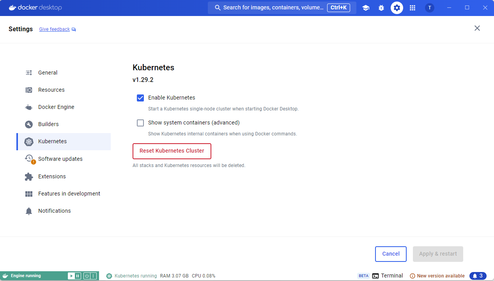
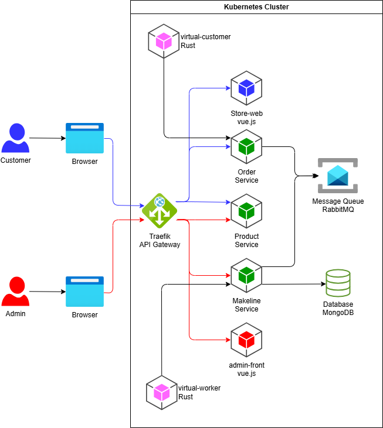
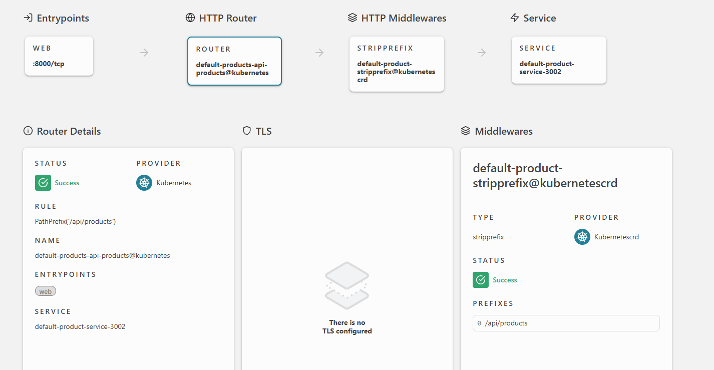

# 02 - Kubernetes, Helm

## Cél

A labor célja:

- megismerni a Kubernetes használatának alapjait
    - a *podok*, *Deployment-ek* és *ReplicaSet-ek* létrehozását és kezelését,
    - a leggyakrabban használt `kubectl` parancsokat.
- egy alkalmazás telepítése Kubernetes klaszterbe és a frissítés módjának megismerése.
    - A telepítéshez és frissítéshez részben Helm chartot, részben magunk által elkészített YAML erőforrás leírókat használunk.

## Előkövetelmények

A labor Windows platformon lett kidolgozva, de Linuxon is hasonlóan működik.

- Kubernetes
    - Bármely felhő platform által biztosított klaszter
    - Linux platformon: [minikube](https://kubernetes.io/docs/start)
    - Windows platformon: Docker Desktop
- [kubectl](https://kubernetes.io/docs/tasks/tools/)
    - A binárisa legyen elérhető PATH-on.
- Egy kubernetes-t menedzselni képes GUI, például:
    - [VS Code Kubernetes extension](https://marketplace.visualstudio.com/items?itemName=ms-kubernetes-tools.vscode-kubernetes-tools)
    - [Lens](https://k8slens.dev/)
    - [Kubernetes Dashboard](https://kubernetes.io/docs/tasks/access-application-cluster/web-ui-dashboard/)
    - [Rider](https://www.jetbrains.com/help/rider/Kubernetes.html) - hallgatói fiókkal ingyenes
    - [k9s](https://k9scli.io/)
- Helm CLI
    - [Helm](https://helm.sh/docs/intro/install/)
    - A Helm CLI legyen elérhető PATH-on.

## Előkészület

A feladatok megoldása során ne felejtsd el követni a feladat beadás folyamatát [GitHub](../../information/GitHub.md).

### Git repository létrehozása és letöltése

1. Moodle-ben keresd meg a laborhoz tartozó meghívó URL-jét és annak segítségével hozd létre a saját repository-dat.
2. Várd meg, míg elkészül a repository, majd checkout-old ki.
3. Hozz létre egy új ágat `megoldas` néven, és ezen az ágon dolgozz.
4. A `neptun.txt` fájlba írd bele a Neptun kódodat. A fájlban semmi más ne szerepeljen, csak egyetlen sorban a Neptun kód 6 karaktere.

!!! danger "NEPTUN"
    :exclamation: A feladatokban a `neptun` kifejezés helyett a saját neptunkódunkat helyettesítsük be minden esetben :exclamation:

## 0. Feladat

### Előkészület Docker Desktop-on

1. Praktikus, ha leállítunk minden futó konténert, amire nincs szükségünk. Használhatjuk a következő parancsot PowerShell-ben:

    ```powershell
    docker rm -f $(docker ps -aq)
    ```

2. Nyissuk meg a Docker Desktop beállításait.

3. A *Kubernetes* fülön pipáljuk be az *Enable Kubernetes* opciót, és kattintsunk az *Apply*-ra.

4. Várjuk meg, amíg befejeződik a művelet. A kubernetes alrendszer elindulása néhány percet is igénybe vehet.

    

### Kubectl csatlakozás a klaszterhez

- Ellenőrizzük, hogy a `kubectl` bináris elérhető-e, és tud-e csatlakozni a klaszterhez:

    ```cmd
    kubectl version
    ```

    A `kubectl` a CLI kliens a klaszter kezeléséhez (ejtsd: cube control).
    A Kubernetes API szerveréhez csatlakozik, annak REST API-ján keresztül végzi a műveleteket.
    Láthatjuk mind a kliens, mind a klaszter verzió információit.

- A `kubectl` egy konkrét klaszterhez csatlakozik. Nézzük meg, milyen klasztereket ismer:

    ```cmd
    kubectl config get-contexts
    ```

  - Ha több klaszterrel dolgoznánk, itt láthatnánk őket.
  - Ezek valójában egy konfigurációs fájlban vannak: `%userprofile%/.kube/config`
  - Váltani a `kubectl config use-context <név>` parancssal lehet.
  - Minden parancsnál külön megadhatjuk a kontextust a `--context` kapcsolóval, de inkább az implicit contextust szoktuk használni.
  - Kontextus beállításról részletesebben [itt](https://kubernetes.io/docs/reference/kubectl/cheatsheet/#kubectl-context-and-configuration).

!!! tip "Kubernetes GUI"
    A feladatokban lévő műveletek szinte mindegyike elvégezhető a GUI (pl.: VS Code kubernetes kiegészítő) segítségével is. A labor leírásaiban a `kubectl` parancsokat fogjuk használni, de a GUI is használható.

## 1. Feladat

### Podok és névterek listázása

- Listázzuk ki a futó podokat:

    ```cmd
    kubectl get pod -A
    ```

    A `-A` vagy `--all-namespaces` kapcsoló az összes névtérben levő podot listázza.

- Ismételjük meg a `-A` kapcsoló nélkül:

    ```cmd
    kubectl get pod
    ```

    Ez az alapértelmezett *default* névtér podjait listázza. (Az alapértelmezett névtér is a kontextus beállítása.)

- Nézzük meg, milyen névterek vannak: `kubectl get namespace`

- Listázzuk a podokat egy konkrét névtérben: `kubectl get pod -n kube-system`

### Pod létrehozása YAML leíróval

Kubernetes erőforrásokat tipikusan YAML leírókban definiálunk. A futtatás elemi egysége a pod, így készítsünk egy YAML fájlt a podunkhoz és indítsuk el azt.

!!! tip ""
    A leíró szerkesztéséhez használhatjuk például Visual Studio Code-ot. Érdemes olyan szövegszerkesztővel dolgozni, amely ismeri a YAML szintaktikát. A parancsok futtatásához használhatjuk például [Visual Studio Code beépített terminálját](https://code.visualstudio.com/docs/terminal/basics).

1. Hozzunk létre egy új YAML fájt a repositorynk gyökerébe `createpod.yml` néven, az alábbi követelmények mentén

    - a kubernetes leíró Pod-ot definiál
    - a pod neve legyen `counter-neptun` a **saját neptunkóddal** kiegészítve
    - a pod egy konténert tartalmazzon, amely az `ubuntu` képből indul
    - a konténer egy bash parancsot futtasson, ami kiírja a *NEPTUN* kódodat és 5 másodpercenként kiírja az aktuális időt.

1. A konzolunkban navigáljunk el abba a könyvtárba, ahol a YAML fájl van, majd hozzuk létre a podot:

    ```cmd
    kubectl apply -f createpod.yml
    ```

    !!! warning "apply vs create"
        A `create` helyett `apply` parancsot használjuk. Az apply létrehozza, ha nem létezik, és módosítja az erőforrást, ha már létezik.

1. A pod létrejött. Ellenőrizzük:

    ```cmd
    kubectl get pod
    ```

1. Nézzük meg a pod logjait:

    ```cmd
    kubectl logs counter-neptun
    ```

    !!! tip ""
        Ha gondoljuk, tegyük hozzá a `-f` kapcsolót is (`kubectl logs -f counter`) a log követéséhez. ++ctrl+c++-vel léphetünk ki a log folyamatos követéséből. Ne feledjük, hogy ez nem a pod terminálja, hanem a logjainak figyelését.

!!! example "BEADANDÓ"
    A feladathoz tartozó forráskódot commitold be és készíts egy képernyőképet (`f1.1.png`), majd commitold azt be a házi feladat repó gyökerébe, amin a futó pod logjai látszanak.

1. Töröljük a podot:

    ```cmd
    kubectl delete pod counter-neptun
    ```

1. Ellenőrizzük, hogy a pod tényleg eltűnik egy kis idő múlva:

    ```cmd
    kubectl get pod
    ```

    !!! note ""
        A pod törlése nem azonnali. A benne futó konténerek leállás jelzést kapnak, és ők maguk terminálhatnak. Ha ez nem történik, meg, akkor kis idő múlva megszünteti őket a rendszer.

??? tip "Interaktív shell"
    Ha szeretnénk egy podban belépni, és ott dolgozni, akkor ezt a `kubectl exec` paranccsal tehetjük meg. Például:

    ```cmd
    kubectl exec -it <podnév> /bin/bash
    ```

    A `-it` kapcsolók interaktív módot és terminált biztosítanak. A `/bin/bash` a shell, amit futtatni szeretnénk.

    Ahogy a docker-nél már láthattuk, egy új shell indul a pod konténerében, és ehhez csatlakozunk.
    Ebben a shellben, ahogy natív docker esetében is, bármit megtehetünk.

## 2 Feladat

### 2.1 Deployment létrehozása

A podokat nem szoktuk közvetlenül létrehozni, hanem *Deployment*-re és *ReplicaSet*-re szoktunk bízni a kezelésüket és létrehozásukat.

1. Hozzunk létre egy új YAML fájlt `createdeployment.yml` néven az alábbi követelményeknek megfelelően:

    - a kubernetes leíró Deployment-et definiál
    - a deployment neve legyen `counter-neptun` a **saját neptunkóddal** kiegészítve
    - a deployment egy olyan konténert definiáljon, mint az 1. feladatban
    - 1 replika legyen az elvárt állapot
    - a selectorok használata során `counter-app-neptun` címkét használjuk a **saját neptunkóddal** kiegészítve

2. Hozzuk létre a Deployment-et:

    ```cmd
    kubectl apply -f createdeployment.yml
    ```

3. Listázzuk a Deployment-eket, ReplicaSet-eket és a podokat:

    ```cmd
    kubectl get deployment
    kubectl get replicaset
    kubectl get pod
    ```

    Vegyük észre, hogy a pod neve generált, a *Deployment* és a *ReplicaSet* alapján kap automatikusan egyet.

!!! example "BEADANDÓ"
    Készíts egy képernyőképet (`f2.1.png`) és commitold azt be a házi feladat repó gyökerébe, amin a futó deployment, replicaset és pod neve látszik.
    Commitold be a forráskódot is.

### 2.2 Deployment frissítése

A *Deployment* szolgál az alkalmazás verziónak frissítésére, kiadására.

Változtassuk meg a program futását a deployment leíróján keresztül: ne 5, hanem 10 másodpercenként írjuk ki az időt.
Ezt a *Deployment* módosításával érhetjük el, mivel podot nem tudunk szerkeszteni hatékonyan, egy futó pod nem cserélhető le.
Ehelyett valójában egy új podot kell létrehozni indirekt módon a deployment frissítésével.

Érvényesítsd a módosítást a deployment leíróban, majd alkalmazd a változást:

```cmd
kubectl apply -f createdeployment.yml
```

Kérjük le a logokat a deployment podjából:

```cmd
kubectl logs -f <podnév>
```

!!! example "BEADANDÓ"
    Készíts egy képernyőképet (`f2.2.png`) és commitold azt be a házi feladat repó gyökerébe, ahol a logokban már 10 másodpercenként történik a kiíratás.

??? tip "Kubectl parancsok"

    A `kubectl` leggyakrabban használt parancsainak szerkezete: `kubectl <ige> <erőforrás> <attribútumok>`.

    Az ige például:

    - `get`: listázza az erőforrásokat
    - `create`: létrehoz egy erőforrást
    - `delete`: töröl egy erőforrást
    - `describe`: lekérdezi az erőforrás részletes állapotát
    - `edit`: letölti az erőforrás leíróját, és megnyitja szövegszerkesztőben; mentés és bezárás után frissíti a klaszterben az erőforrást a módosítások alapján

    Az erőforrások a `pod`, `replicaset` vagy röviden `rs`, a `deployment`, stb.

    A parancsokról `-h` kapcsolóval kaphatunk segítséget, pl. `kubectl describe -h`

## 3. Feladat

### Célok

A célunk a kiinduló repóban lévő (`storeapp` mappa), megrendeléseket kezelő konténeralapú, külön álló (mikro)szolgáltatásokra épülő webalkalmazás telepítése Kubernetes-be. Forrás: <https://github.com/Azure-Samples/aks-store-demo>

A rendszer az alábbit komponensekből áll:



|Szolgáltatás|Leírás|
|------------|------|
|mongodb|MongoDB példány az adatok tárolásához|
|rabbitmq|RabbitMQ a megrendelési üzenetsorhoz|
|makeline-service|Ez a szolgáltatás kezeli a rendelések feldolgozását (üzenetsorból) és perzisztálását (db-be) (Golang)|
|order-service|Ez a szolgáltatás a rendelések leadására szolgál, ami az üzenetsorba küld üzeneteket (Javascript)|
|product-service|Ez a szolgáltatás a termékek CRUD műveleteit végzi memóriában, perzisztens tár nélkül (Rust)|
|store-front|Webalkalmazás, amelyen keresztül a vásárlók rendeléseket adhatnak le (Vue.js)|
|store-admin|Webalkalmazás, amelyet az üzlet dolgozói használnak a sorban lévő rendelések megtekintésére és a termékek kezelésére (Vue.js)|
|traefik|API gateway és Ingress Controller|
|virtual-customer|Ütemezetten szimulálja a rendelés létrehozását (Rust)|
|virtual-worker|Ütemezetten szimulálja a rendelés teljesítését (Rust)|

Feladatunk a következő:

1. Telepítsük a Traefik api gateway-t Helm chart-tal.
2. Telepítsük a MongoDB és RabbitMQ komponenseket YAML leírókkal.
3. Telepítsük az alkalmazásunk saját komponenseit YAML leírókkal.
4. Hozzuk létre az Ingress szabályokat, hogy a Traefik tudja, hova továbbítsa a bejövő kéréseket.
5. Ellenőrizzük, hogy minden szolgáltatás elérhető-e a Traefik-en keresztül.

### 3.0 Helm

Ellenőrizzük, hogy a `helm` CLI elérhető-e:

```cmd
helm version
```

!!! warning "Helm 3"
    A feladat során a Helm 3-as verzióját fogjuk használni. A korábbi verziója koncepcióban azonos, de működésében eltérő.

### 3.1 Ingress Controller (api gateway) telepítése Helm charttal

A Traefik-et [Helm charttal](https://github.com/traefik/traefik-helm-chart) fogjuk telepíteni, mert a Traefik helyes működéséhez a Traefik konténer (Deployment) mellett egyéb [CRD](https://kubernetes.io/docs/concepts/extend-kubernetes/api-extension/custom-resources/) elemekre is szükség lesz a konfigurációhoz.

!!! warning "Chart-ok ellenőrzése"
    A Helm chartok nagy része harmadik féltől származik, így a klaszterünbe való telepítés előtt a tartalmukat érdemes alaposan megnézni.

1. A Helm is repository-kkal dolgozik, ahonnan a chart-okat letölti. Ezeket regisztrálni kell. Regisztráljuk a Traefik hivatalos chart-ját tartalmazó repository-t, majd frissítsük az elérhető char-okat:

    ```cmd
    helm repo add traefik https://traefik.github.io/charts
    helm repo update
    ```

1. Telepítsük:

    ```cmd
    helm install traefik traefik/traefik --set ports.web.nodePort=32080 --set service.type=NodePort --set "additionalArguments={--api.insecure=true}"
    ```

     - A legelső `traefik` a Helm release nevét adja meg. Ezzel tudunk rá hivatkozni a jövőben.
     - A `traefik/traefik` azonosítja a telepítendő chartot (repository/chartnév).
     - A `--set` kapcsolóval a chart változóit állítjuk be.

    !!! info "Publikus eléréshez"
        A Traefik jelen konfigurációban *NodePort* service típussal van konfigurálva, ami azt jelenti, lokálisan, helyben a megadott porton lesz csak elérhető. Ha publikusan elérhető klaszterben dolgozunk, akkor tipikusan *LoadBalancer* service típust fogunk kérni, hogy publikus IP címet is kapjon a Traefik.

        Továbbá itt az alapértelmezett 80-as port helyett a 32080-as portot használjuk, hogy ne ütközzön a gépünkön esetlegesen futó egyéb szolgáltatásokkal.
        Így a klaszterünk belépési pontja a <http://localhost:32080> címen lesz elérhető.

1. Ellenőrizzük, hogy fut-e:

    ```cmd
    kubectl get pod
    ```

    Látunk kell egy traefik kezdetű podot.

1. A Traefik dashboard-ja nem elérhető "kívülről".
   A dashboard segít minket látni a Traefik konfigurációját és működését.
   Mivel ez a klaszter belső állapotát publikálja, production üzemben valamilyen módon authentikálnunk kellene.
   Ezt most megkerülve `kubectl` segítségével egy helyi portra továbbítjuk a Traefik dashboard-ot (és a telepítéskor insecure módba kapcsoltuk).
   A port átirányítást próbáljuk most a VSCode Kubernetes extension segítségével:

    

    Fogadjuk el az elapértelmezett értékeket (`9100:metrics 8080:traefik 8000:web 8443:websecure`). Így a Traefik dashboard a <http://localhost:8080/dashboard> címen lesz elérhető.

    ??? tip "Port forward parancs"

        Ahogy látjuk a GUI-s K8S eszközök is csak a `kubectl port-forward` parancsot használják a háttérben.

        Ha nem használunk GUI-t, akkor a port forward parancs a következő, amibe ráadásul nem égettük bele a pod nevét:

        ```bash
        kubectl port-forward $(kubectl get pods --selector "app.kubernetes.io/name=traefik" --output=name) 9100:9100 8080:8080 8000:8000 8443:8443 -n default
        ```

1. Nézzük meg a Traefik dashboardot: <http://localhost:8080/dashboard/>

!!! note ""
    Ha frissíteni szeretnénk később a Traefik-et, akkor azt a `helm upgrade traefik traefik/traefik ...` paranccsal tudjuk megtenni.

### 3.2 Adatbázisok telepítése

Az adatbázisainkat a már megírt YAML leírókkal telepítjük. Ez a leíró fájl már rendelkezésünkre áll a kiinduló repository `storeapp` almappájában.

1. Vizsgáljuk meg a repository `storeapp/hf-kubernetes/db` könyvtárában lévő YAML leírókat.

     - MongoDB: StatefulSet-ként telepítjük, és a perzisztens adattároláshoz dinamikus PersistentVolumeClaim-et használunk
     - RabbitMQ: StatefulSet-ként telepítjük, és a perzisztens adattároláshoz dinamikus PersistentVolumeClaim-et használunk

1. Telepítsük az adatbázisokat:

    ```cmd
    kubectl apply -f storeapp/hf-kubernetes/db
    ```

    !!! tip ""
        A `kubectl apply` parancs `-f` kapcsolója ha mappát kap, akkor a mappában lévő összes yaml fájlt alkalmazza.

1. Ellenőrizzük, hogy az adatbázis podok elindulnak-e (pl.: GUI-val). Minden a *default* névtérbe kellett települjön.

### 3.3 Alkalmazásunk telepítése

Az alkalmazásunk telepítéséhez szintén YAML leírókat találunk a `storeapp/hf-kubernetes/app` könyvtárban.

1. Nézzük meg a leírókat.

1. Telepítsük az alkalmazásokat:

    ```cmd
    kubectl apply -f storeapp/hf-kubernetes/app
    ```

1. Ellenőrizzük, hogy létrejöttek a Deployment-ek podok. A *store-front* és *store-admin* podoknak nem fognak tudni elindulni, mert a leíró olyan (lokális) image-eket használnak, amelyek nincsenek lebuildelve a gépünkön. A többi szolgáltatás esetében egy távoli publikus konténer registry-ből húzza le a szükséges image-eket.

1. Ezeket az image-eket az `storeapp/src/store-admin` és `storeapp/src/store-front` könyvtárban tudjuk lebuildelni. Nyissunk egy új terminál ablakot, navigáljunk el a `storeapp` megfelelő könyvtárába, és futtassuk a `docker build` parancsokat:

    ```cmd
    cd storeapp/src/store-front
    docker build -t store-front:local .
    cd ../store-admin
    docker build -t store-admin:local .
    ```

    !!! tip "Pod újraindítása"
        Ha nem akarjuk kivárni az rendszer általi újraindítást töröljük ki a pod-ot kézzel, aminek hatására a deployment létrehoz egy új pod-ot, ami már a helyi image-t fogja használni.

    ??? tip "Ha mégsem zöldülnek ki"

        1. Egyes Linuxos gépeken nem vállnak alapvetően láthatóvá a minikube-on belül az image-ek. Az ilyen gépeken érdemes a következő parancs előtt az `eval $(minikube docker-env)` parancsot kiadni.
        Ezt követően ebben a terminál ablakban adjuk ki az image build paracsomat, valamint a k8s apply parancsokat is.
        
        2. Ugyanez Windows-os + minikube powershellel:
        Lehet, hogy nem a minikube-ban vannak a docker image-ek. Ekkor PowerShellben a `& minikube -p minikube docker-env --shell powershell | Invoke-Expression` paranccsal tudod elérni, hogy a minikube-ban lévő docker daemont használd.
        Ha ez a parancs `❌  Exiting due to MK_USAGE: the docker-env command only supports the docker and containerd runtimes` errort dobna: Add ki a `minikube delete` parancsot, majd indítsd el a következő módon: `minikube start --driver=docker --container-runtime=docker`

1. Mivel még nincs ingress szabály ezért próbáljuk ki port forwarddal a `store-front` szolgáltatást a 3000-es porton. Az oldal betölt, de nem éri el a `product-service` szolgáltatást, mert nincs ingress szabály.

### 3.4 Ingress szabályok

Az alkalmazásunkban még nincsenek ingress szabályok, ezért az Ingress Controller (most a Traefik) nem tudja, hogy a bejövő kéréseket hova kell továbbítani.
Hozzuk létre ezeket a szabályokat, kezdjük az mikroszolgáltatásokkal.

1. A `storeapp/hf-kubernetes/app` könyvtárban módosítsuk a `product-service.yaml` fájlt, és adjuk hozzá a következő Ingress erőforrást:

    ```yaml
    ---
    apiVersion: networking.k8s.io/v1
    kind: Ingress
    metadata:
      name: products
      labels:
        app.kubernetes.io/name: products
        storedemo.tier: backend
      annotations:
        traefik.ingress.kubernetes.io/router.entrypoints: web
        traefik.ingress.kubernetes.io/router.middlewares: product-stripprefix@kubernetescrd
    spec:
      rules:
        - http:
            paths:
              - path: /api/products
                pathType: Prefix
                backend:
                  service:
                    name: product-service
                    port:
                      number: 3002
    ```

    Van viszont egy probléma: a `product-service` szolgáltatás nem a `/api/products` útvonalon várja a kéréseket, hanem a `/` útvonalon.
    A `/api/products` útvonalat csak a frontend ismeri.
    Ezt a problémát a Traefik *middleware* funkciójával tudjuk megoldani.
    A middleware-ek a Traefik-ben olyan komponensek, amelyek a bejövő kéréseket módosítják, mielőtt továbbítanák azokat a backend szolgáltatások felé.
    A Traefik-ben van egy *StripPrefix* middleware, amely eltávolítja a megadott prefixet a kérés URL-jéből.
    Ezt a middleware-t kell alkalmaznunk a `products` Ingress-re.

1. A `product-service.yaml` fájlban definiáljuk a middleware CRD erőforrást az Ingress szabályunk előtt:

    ```yaml
    ---
    apiVersion: traefik.io/v1alpha1
    kind: Middleware
    metadata:
      name: product-stripprefix
    spec:
      stripPrefix:
        prefixes:
          - /api/products
    ```

1. A `product-service.yaml` fájlban adjuk hozzá a következő részt az Ingress erőforráshoz, az `annotations` szekcióba:

    ```yaml
    annotations:
      traefik.ingress.kubernetes.io/router.middlewares: default-product-stripprefix@kubernetescrd
    ```

    !!! warning "Namespace"
        A middleware neve tartalmazza a névteret is: `namespace-product-stripprefix@kubernetescrd`

1. Érvényesítsük a módosítást.

    ```cmd
    kubectl apply -f store-demo/kubernetes/app
    ```

1. Nyissuk meg a Traefik dashboardját és vizsgáljuk meg a konfigurált végpontot, majd próbáljuk ki a működését a <http://localhost:32080/api/products> címen.

    

1. Hasonlóan adjuk hozzá az Ingress szabályokat és a szükséges middleware-eket a `order-service.yaml` és a `makeline-service.yaml` fájlokhoz is.
   Mind a két esetben a szolgáltatások a `/` gyökér útvonalon várják a kéréseket, míg az Ingress szabályokban a `/api/orders` és `/api/makeline` útvonalakat kell használni.

1. Vegyük fel a publukus frontend szolgáltatás Ingress szabályát is a `store-web.yaml` fájlba.
   **Itt nem szükséges a middleware**, mert a frontend szolgáltatás a `/` gyökér útvonalon várja a kéréseket az ingress-en keresztül is és a webszervben is.

1. Vegyük fel az admin frontend szolgáltatás Ingress szabályát is az `store-admin.yaml` fájlba.
   Az ingress-t úgy konfiguráljuk fel, hogy a `/admin` útvonalra érkező kéréseket továbbítsa a `store-admin` szolgáltatás `/` útvonalára.

1. Érvényesítsük a módosításokat, és próbáljuk ki az alakalmazásunkat a <http://localhost:32080> és a <http://localhost:32080/admin> címen. A tesztelendő funkciókat az alábbi Beadandó részben találhatod.

!!! example "BEADANDÓ"
    Készíts az alábbi tesztesetekről képernyőképeket, és commitold be a házi feladat repó gyökerébe:

    - Admin felület
        - Az admin felületen megjelennek a termékek a *Products* menüpont alatt. (`f3.4.1.png`)
        - Az *Edit* gombra kattintva módosítsuk a termék nevét, hogy tartalmazza a NEPTUN kódunkat, majd mentsük el és nézzük meg a változást a listában. (`f3.4.2.png`)
    - Publikus oldal
        - A főoldalon megjelennek a termékek (a NEPTUN kódunkat tartalmazó is). (`f3.4.3.png`)
        - Egy NEPTUN kódot tartalmazó termék kiválasztásával a termék részletei is megjelennek. (`f3.4.4.png`)
        - Az *Add to cart* gombra kattintva a termék bekerül a kosárba.
        - A *Cart* szövegre kattintva megjelenik a kosár tartalma. (`f3.4.5.png`)
        - A *Proceed to checkout* gombra kattintva a rendelés elküldhető (sikeres üzenet). (`f3.4.6.png`)
    - Admin felület
        - Az *Orders* menüpont alatt megjelennek a beérkezett (friss) rendelések.
        - A megrendelésre kattintva megjelennek a rendelés részletei, ami tartalmazza a NEPTUN kódunkat is. (`f3.4.7.png`)
        - A *Complete Order* gombra kattintva az állapot módosítás sikeres a rendelés állapota *Completed*-re változik. (`f3.4.8.png`)

## 4. Feladat

Helm chartot eddig meglévő komponensek paraméterezhető telepítésére használtunk. Készítsünk most mi Helm chartot a *virtual-customer* és *virtual-worker* szolgáltatások paraméterezhető telepítéséhez.

### Helm chart készítése

1. Hozzuk létre a repository-nkban a `/storeapp/helmchart` mappát majd a konzolban navigáljunk oda.

1. Készítsünk egy új, üres chart-ot, az alábbi paranccsal, ami létrehoz egy *storeapp* nevű chartot egy azonos nevű könyvtárban.

    ```cmd
    helm create storeapp
    ```

1. Nézzük meg a chart fájljait.

    - `Chart.yaml` a metaadatokat írja le.
    - `values.yaml` írja le a változóink alapértelmezett értékeit.
    - `.helmignore` azon fájlokat listázza, amelyeket a chart értelmezésekor nem kell figyelembe venni.
    - `templates` könyvtárban vannak a template fájlok, amik a generálás alapjául szolgálnak.

    A Helm egy olyan template nyelvet használ, amelyben változó behelyettesítések, ciklusok, egyszerű szövegműveletek támogatottak.

1. Töröljük ki a `templates` könyvtárból az összes fájlt a `_helpers.tpl` kivételével. Töröljük ki a `values.yaml` fájlból is a tartalmat.

1. Másoljuk be a `storeapp/hf-kubernetes/simulation` mappából a `virtual-customer.yaml` és `virtual-worker.yaml` fájlokat a `templates` könyvtárba.

1. Módosítsuk a fenti két yaml leírót a következő követelmények szerint a helm szintaktika használatával:

    - A pod neve tartalmazza a `neptun` kódunkat pl.: `virtual-customer-neptun`, ebből a neptun kódot a `values.yaml` fájlban definiált változóból helyettesítsük be.
    - A deployment leírók legyen feltételesen végrehajtva, tehát csak akkor jöjjenek létre az erőforrások, ha a `values.yaml` fájlban a `virtualCustomer.enabled` illetve `virtualWorker.enabled` értéke true.
    - A `virtualCustomer` és `virtualWorker` pod-ok  `ORDERS_PER_HOUR` környezeti változóji legyenek paraméterezhetőek a `values.yaml` fájlban a `virtualCustomer.ordersPerHour` és `virtualWorker.ordersPerHour` változójával.

    !!! tip "Helm template szintaktika"
        A Helm template szintaktikájáról részletesen olvashatsz [itt](https://helm.sh/docs/chart_template_guide/).

1. Nézzük meg a template-eket kiértékelve.

   - Lépjünk vissza a `storeapp/helmchart` könyvtárba:
   - Futtassuk le csak a template generálást a telepítés nélkül:

     ```cmd
     helm install storeapp --debug --dry-run storeapp
     ```

   - A release-nek _storeapp_ nevet választottunk. Ez a Helm release azonosítója.

   - Konzolra megkapjuk a kiértékelt YAML-öket. Ellenőrizzük a kimenetben, hogy a rendben behelyettesítődtek-e.

1. Telepítsük az alkalmazás komponenseit a chart segítségével:

    ```cmd
    helm upgrade storeapp --install storeapp
    ```

    - Az `upgrade` parancs és az `--install` kapcsoló telepít, ha nem létezik, ill. frissít, ha már létezik ilyen telepítés.

1. Nézzük meg, hogy a Helm szerint létezik-e a release: `helm list`

1. Próbáljuk ki az alkalmazást a <http://localhost:32080/admin> címen, és vegyük észre, hogy a megrendelések automatikusan érkeznek a virtuális vásárlóktól és lezárulnak a virtuális dolgozók által.

1. A változók értékeit a values fájlból definiáljuk felül a telepítési parancsban a `--set` kapcsolóval.

    ```cmd
    helm upgrade storeapp --install storeapp --set virtualCustomer.ordersPerHour=10 --set virtualWorker.ordersPerHour=20
    ```

!!! example "BEADANDÓ"
    Készíts egy képernyőképet (`f4.1.png`) és commitold azt be a házi feladat repó gyökerébe, ahol az újonnan létrehozott futó pod-ok látszanak.

    Készíts egy képernyőképet (`f4.2.png`) és commitold azt be a házi feladat repó gyökerébe, demonstrálod, hogy létrejött a helm release k8s-ben a felüldefiniált környezeti változókkal.
